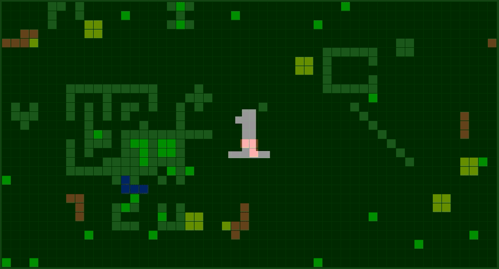

# Snake-Bot

### Install Snake-Bot

```
go install github.com/ivan1993spb/snake-bot@latest
```

### Start Snake-Server

```
docker run --rm -d -p 8080:8080 ivan1993spb/snake-server:latest --enable-web

# Create a game
curl -X POST -d limit=15 -d width=100 -d height=60 -d enable_walls=true localhost:8080/api/games
```

### Start Snake-Bot

```
# Generate a secret for JWT
openssl rand -base64 -out secret.base64 32

snake-bot -snake-server localhost:8080 -jwt-secret secret.base64 -address :9090
```

### Generate JWT

```
python3 scripts/getjwt.py --subject admin --jwt-secret secret.base64 > token.jwt
token=`cat token.jwt`
header="Authorization: Bearer ${token}"
```

### Call the API

```
# Get config
curl -X GET -H "$header" localhost:9090/api/bots
# Add 1 bot in game 1
curl -X POST -H "$header" -d game=1 -d bots=1 localhost:9090/api/bots

cd examples
curl -X POST -H "$header" --data-binary @bots.yaml -H 'Content-Type: text/yaml' localhost:9090/api/bots
curl -X POST -H "$header" --data-binary @bots.json -H 'Content-Type: application/json' localhost:9090/api/bots
```

### Watch the result

[](http://localhost:8080)

### How it works

[wiki: Dijkstra's algorithm](https://en.wikipedia.org/wiki/Dijkstra%27s_algorithm)

### License

See [LICENSE](LICENSE).
